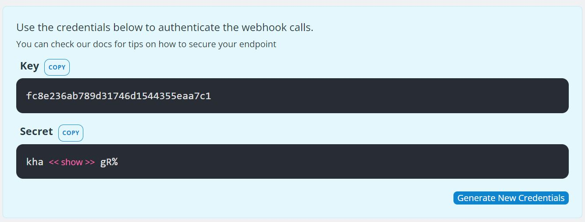

# Teamup Webhook SDK
This library provides some auxiliary code to receive, validate and
process the data sent by Teamup in a webhook call. You can also check
our [API Docs](https://apidocs.teamup.com/) for more details related to
the API and Webhook itself.

## First steps
First of all, you need to create a new webhook in your Teamup calendar.

To achieve that you need to:

``Access your calendar`` > ``Settings`` > ``Navigate to API`` > ``Click New Webhook``

In the form that will open, enter the information related to the webhook.
For local development you can use a tunnel like [LocalTunnel](https://www.npmjs.com/package/localtunnel)
to route your localhost deployment.

After configured, you will have access to your credentials pair. We will need it to verify
the integrity of the webhook calls to make sure it is coming from Teamup servers.


## Webhook Implementation

The webhook serving is pretty straight forward. It should not
have any heavy computation, the intention of it is only to receive the Teamup events.

Here you can use some structure to handle events, like [Symfony Messenger](https://symfony.com/doc/current/messenger.html)
or [Event Dispatcher](https://symfony.com/doc/current/event_dispatcher.html)

A simple implementation may look like:

```php
use \Teamup\Webhook\Webhook;
use \Teamup\Webhook\Parser;
use \Teamup\Webhook\Trigger;

use \Psr\Http\Message\RequestInterface;

$myAccessKey = 'please-do-not-hard-code-it';
$mySecretKey = 'please-grab-from-env';

/** @var RequestInterface $request */
$request = CreateRequestFromGlobals();

$webhook = new Webhook(new Parser([
    $myAccessKey => $mySecretKey,
]));

$webhook->registerHandler(Trigger::Any, new MyLogHandler());
$webhook->registerHandler(Trigger::EventCreated, new OnEventCreatedHandler());

$webhook->handle($request);
```

You can also use directly the parser for a simpler approach:

```php
use \Teamup\Webhook\Parser;
use \Teamup\Webhook\Header;

$content = file_get_contents('php://input');

$parser = new Parser([
    'myKey' => 'mySecret',
]);

// should throw InvalidSignatureException if the signature does not match
// the given pair of keys
$parser->verifyIntegrity(
    getRequestHeader(Header::TeamupAccessKey->value),
    $content,
    getRequestHeader(Header::TeamupSignature->value),
);

// If the integrity is verified, you can parse it or just process the raw payload
$payload = $parser->parse($content);
```
